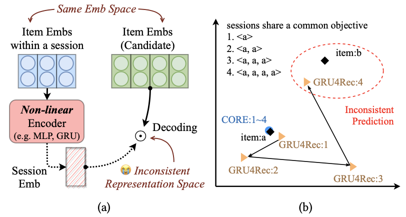
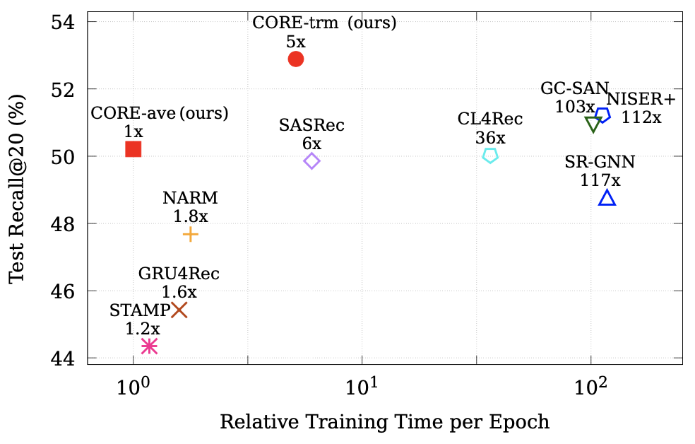

# CORE

This is the official PyTorch implementation for the [paper](https://arxiv.org/abs/2204.11067):
> Yupeng Hou, Binbin Hu, Zhiqiang Zhang, Wayne Xin Zhao. CORE: Simple and Effective Session-based Recommendation within Consistent Representation Space. SIGIR 2022 short.

## Overview

We argue that session embedding encoded by non-linear encoder is usually not in the same representation space as item embeddings, resulting in the inconsistent prediction issue. In this work, we aim at unifying the representation space throughout the encoding and decoding process in session-based recommendation, and propose a simple and effective framework named CORE.

<div  align="center"> 

</div>

## Requirements

```
recbole==1.0.1
python==3.7
pytorch==1.7.1
cudatoolkit==10.1
```

## Datasets

you can download the processed datasets from [Google Drive](https://drive.google.com/drive/folders/1dlJ3PzcT5SCN8-Mocr_AIQPGk9DVgTWB?usp=sharing). Then,
```bash
mv DATASET.zip dataset
unzip DATASET.zip
```

`DATASET` can be one of
* `diginetica`
* `nowplaying`
* `retailrocket`
* `tmall`
* `yoochoose`

## Reproduction

```bash
python main.py --model MODEL --dataset DATASET
```

`MODEL` can be one of
* `trm`
* `ave`

## Results

Here we show results on Diginetica for example, other results can be found in our paper.

**Note that we use a more standard and unified pipeline for fair evaluation and preventing overfitting.**

We split the sessions in each dataset into train/validation/test set in temporal order in a ratio of 8:1:1. We report results on the test set with models that gain the highest performance on the validation set.

|Model|R@20|MRR@20|
|-|-|-|
|CORE-ave|50.21|18.07|
|CORE-trm|52.89|18.58|



## Acknowledgement

The implementation is based on the open-source recommendation library [RecBole](https://github.com/RUCAIBox/RecBole) and [RecBole-GNN](https://github.com/RUCAIBox/RecBole-GNN).

Please cite the following papers as the references if you use our codes or the processed datasets.

```
@inproceedings{hou2022core,
  author = {Yupeng Hou and Binbin Hu and Zhiqiang Zhang and Wayne Xin Zhao},
  title = {CORE: Simple and Effective Session-based Recommendation within Consistent Representation Space},
  booktitle = {{SIGIR}},
  year = {2022}
}


@inproceedings{zhao2021recbole,
  title={Recbole: Towards a unified, comprehensive and efficient framework for recommendation algorithms},
  author={Wayne Xin Zhao and Shanlei Mu and Yupeng Hou and Zihan Lin and Kaiyuan Li and Yushuo Chen and Yujie Lu and Hui Wang and Changxin Tian and Xingyu Pan and Yingqian Min and Zhichao Feng and Xinyan Fan and Xu Chen and Pengfei Wang and Wendi Ji and Yaliang Li and Xiaoling Wang and Ji-Rong Wen},
  booktitle={{CIKM}},
  year={2021}
}
```
